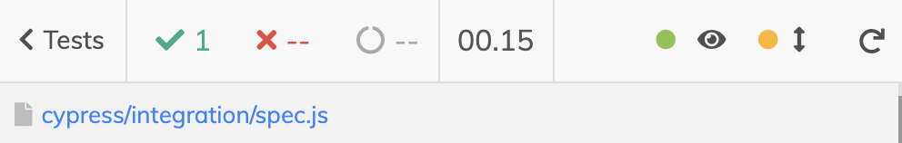

# cypress-watch-and-reload [](https://circleci.com/gh/bahmutov/cypress-watch-and-reload) [![renovate-app badge][renovate-badge]][renovate-app]

> Reloads Cypress when one of the watched files changes

🎓 Covered by my course [Cypress Plugins](https://cypress.tips/courses/cypress-plugins)

## Video

Watch this plugin in action in the short video [Re-run Cypress Tests When Application Files Change](https://www.youtube.com/watch?v=mIyTBtUmmdE) and [Nodemon And cypress-watch-and-reload Utilities](https://youtu.be/fy4qYGK690Q)

## Install

```shell
npm install -D cypress-watch-and-reload
# or using Yarn
yarn add -D cypress-watch-and-reload
```

### Cypress v10+

Load this plugin from your [cypress.config.js](./cypress.config.js) file

```js
const { defineConfig } = require('cypress')

module.exports = defineConfig({
  e2e: {
    env: {
      // list the files and file patterns to watch
      'cypress-watch-and-reload': {
        watch: ['page/*', 'circle.yml'],
      },
    },
    // We've imported your old cypress plugins here.
    // You may want to clean this up later by importing these.
    setupNodeEvents(on, config) {
      // https://github.com/bahmutov/cypress-watch-and-reload
      return require('cypress-watch-and-reload/plugins')(on, config)
    },
  },
})
```

Add to your `cypress/support/e2e.js` file

```js
require('cypress-watch-and-reload/support')
```

Note: this plugin will work if you pass both `on` and `config` arguments, or just the `config` argument.

```js
// pass both arguments
require('cypress-watch-and-reload/plugins')(on, config)
// or pass just the config object
require('cypress-watch-and-reload/plugins')(config)
```

**Important:** make sure to return the plugin registration or the `config` object

```js
// return the registration
setupNodeEvents(on, config) {
  return require('cypress-watch-and-reload/plugins')(on, config)
}
// or return the config object
setupNodeEvents(on, config) {
  require('cypress-watch-and-reload/plugins')(on, config)
  return config
}
```

### Cypress v9

Add to your `cypress/plugins/index.js` file

```js
module.exports = (on, config) => {
  // https://github.com/bahmutov/cypress-watch-and-reload
  require('cypress-watch-and-reload/plugins')(config)
  // IMPORTANT: return the config object
  // because the plugin might have changed it
  return config
}
```

Add to your `cypress/support/index.js` file

```js
require('cypress-watch-and-reload/support')
```

In your `cypress.json` set wildcard with files to watch. For example

```json
{
  "cypress-watch-and-reload": {
    "watch": "page/*"
  }
}
```

Every time you change one of the files matching the wildcard, Cypress will reload itself, rerunning the tests.

You can use a list of files / wildcard patterns to watch:

```json
{
  "cypress-watch-and-reload": {
    "watch": ["page/*", "src/*.js"]
  }
}
```

This package uses [chokidar](https://github.com/paulmillr/chokidar) under the hood, see [plugins.js](plugins.js). The client-side setup is disabled if you are running Cypress in non-interactive mode using `cypress run` command.

## UI

There is a button to disable watching the files, which is useful sometimes to modify lots of files before running the tests.



## Example

See the projects [cypress-watch-and-reload-example](https://github.com/bahmutov/cypress-watch-and-reload-example) and [chat.io](https://github.com/bahmutov/chat.io)

## Details

This plugin opens a WebSocket connection from Cypress to its Node backend. The backend is watching the specified files. Whenever you change a file, Cypress will notice and will reload itself, rerunning tests.

## Development

To see the plugin in action, open Cypress in this repository

```shell
npm run cy:open
```

Then edit and save any file in the "page" folder and see the tests re-run automatically.

## Small print

Author: Gleb Bahmutov &lt;gleb.bahmutov@gmail.com&gt; &copy; 2020

- [@bahmutov](https://twitter.com/bahmutov)
- [glebbahmutov.com](https://glebbahmutov.com)
- [blog](https://glebbahmutov.com/blog)
- [videos](https://www.youtube.com/glebbahmutov)
- [presentations](https://slides.com/bahmutov)
- [cypress.tips](https://cypress.tips)

License: MIT - do anything with the code, but don't blame me if it does not work.

Support: if you find any problems with this module, email / tweet /
[open issue](https://github.com/bahmutov/cypress-watch-and-reload/issues) on Github

## MIT License

Copyright (c) 2020 Gleb Bahmutov &lt;gleb.bahmutov@gmail.com&gt;

Permission is hereby granted, free of charge, to any person
obtaining a copy of this software and associated documentation
files (the "Software"), to deal in the Software without
restriction, including without limitation the rights to use,
copy, modify, merge, publish, distribute, sublicense, and/or sell
copies of the Software, and to permit persons to whom the
Software is furnished to do so, subject to the following
conditions:

The above copyright notice and this permission notice shall be
included in all copies or substantial portions of the Software.

THE SOFTWARE IS PROVIDED "AS IS", WITHOUT WARRANTY OF ANY KIND,
EXPRESS OR IMPLIED, INCLUDING BUT NOT LIMITED TO THE WARRANTIES
OF MERCHANTABILITY, FITNESS FOR A PARTICULAR PURPOSE AND
NONINFRINGEMENT. IN NO EVENT SHALL THE AUTHORS OR COPYRIGHT
HOLDERS BE LIABLE FOR ANY CLAIM, DAMAGES OR OTHER LIABILITY,
WHETHER IN AN ACTION OF CONTRACT, TORT OR OTHERWISE, ARISING
FROM, OUT OF OR IN CONNECTION WITH THE SOFTWARE OR THE USE OR
OTHER DEALINGS IN THE SOFTWARE.

[renovate-badge]: https://img.shields.io/badge/renovate-app-blue.svg
[renovate-app]: https://renovateapp.com/
